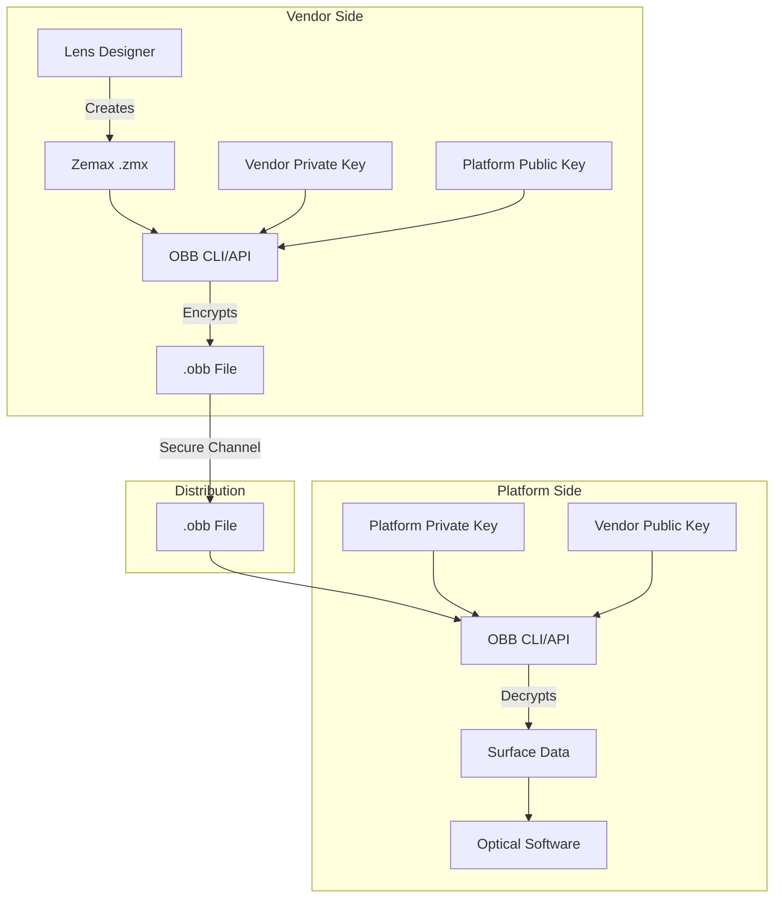
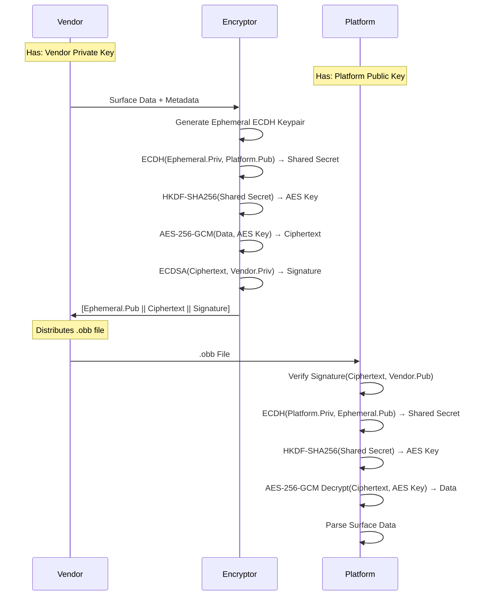
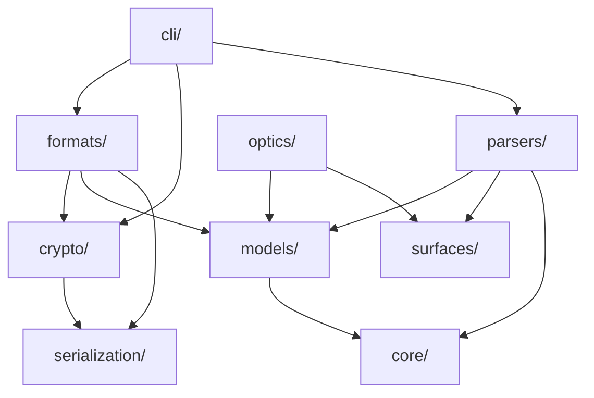
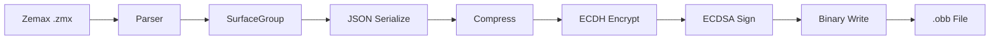
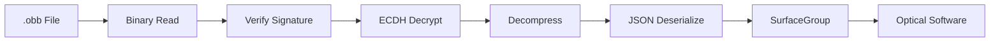

# Architecture Documentation

Technical architecture overview of Optical BlackBox.

## System Overview



---

## Security Architecture

### Hybrid Encryption Flow



### Key Hierarchy

```
Vendor                         Platform
  │                              │
  ├─ Private Key (ECDSA P-256)   ├─ Private Key (ECDSA P-256)
  │   └─ Signs encrypted data    │   └─ Decrypts received files
  │                              │
  └─ Public Key                  └─ Public Key
      └─ Distributed to platform     └─ Distributed to vendors
```

**Key Properties:**
- **Vendor Private Key**: Signs encrypted data, proves authenticity
- **Platform Private Key**: Decrypts data, kept secret by platform
- **Ephemeral Keys**: Generated per-file, provides forward secrecy

---

## Module Architecture

### Package Structure

```
optical_blackbox/
├── cli/              # Command-line interface
│   └── main.py       # Click commands
│
├── crypto/           # Cryptographic primitives
│   ├── aes_gcm.py    # AES-256-GCM encryption
│   ├── ecdh.py       # ECDH key agreement
│   ├── keys.py       # Key management
│   ├── signing.py    # ECDSA signatures
│   └── hybrid.py     # High-level encryption API
│
├── core/             # Core utilities
│   ├── result.py     # Result<T,E> type
│   └── validators.py # Input validation
│
├── formats/          # File format handling
│   ├── obb_file.py   # Reader/Writer
│   ├── obb_header.py # Binary header
│   └── obb_payload.py# Payload structure
│
├── models/           # Data models (Pydantic)
│   ├── surface.py
│   ├── surface_group.py
│   ├── metadata.py
│   └── optical_config.py
│
├── optics/           # Optical calculations
│   ├── paraxial.py   # ABCD matrices
│   └── glass_catalog.py
│
├── parsers/          # Input format parsers
│   ├── registry.py
│   └── zemax/
│       ├── zmx_parser.py
│       └── zmx_surface_mapper.py
│
├── serialization/    # Binary/JSON/PEM utilities
│   ├── binary.py
│   ├── json_codec.py
│   └── pem.py
│
└── surfaces/         # Surface representations
    ├── standard.py
    ├── even_asphere.py
    └── registry.py
```

### Dependency Graph



---

## Data Flow

### Encryption Pipeline



### Decryption Pipeline



---

## File Format Structure

### OBB Binary Layout

```
┌──────────────────────────────────────────────────────┐
│ Magic Bytes (4 bytes): "OBB\x01"                     │
├──────────────────────────────────────────────────────┤
│ Header (variable length)                             │
│  ├─ Version: u16                                     │
│  ├─ Metadata Length: u32                             │
│  ├─ Metadata JSON (unencrypted)                      │
│  │   ├─ vendor_id                                    │
│  │   ├─ name                                         │
│  │   ├─ efl_mm, na, diameter_mm                      │
│  │   └─ signature (base64)                           │
│  ├─ Ephemeral Public Key Length: u32                 │
│  └─ Ephemeral Public Key (PEM)                       │
├──────────────────────────────────────────────────────┤
│ Encrypted Payload                                    │
│  ├─ Nonce (12 bytes)                                 │
│  └─ Ciphertext + Auth Tag                            │
│      └─ [Compressed JSON SurfaceGroup]               │
└──────────────────────────────────────────────────────┘
```

### Metadata JSON Schema

```json
{
  "vendor_id": "thorlabs",
  "name": "AC254-050-A",
  "efl_mm": 50.0,
  "bfl_mm": 45.0,
  "na": 0.25,
  "diameter_mm": 25.4,
  "spectral_range_nm": [400.0, 700.0],
  "num_surfaces": 4,
  "description": "Achromatic doublet",
  "part_number": "AC254-050-A",
  "created_at": "2026-02-02T10:30:00Z",
  "signature": "<base64-encoded-ecdsa-signature>",
  "version": "1.0.0"
}
```

### SurfaceGroup JSON Schema

```json
{
  "surfaces": [
    {
      "surface_number": 1,
      "surface_type": "standard",
      "radius": 100.0,
      "thickness": 5.0,
      "material": "N-BK7",
      "semi_diameter": 12.7,
      "conic": 0.0
    }
  ],
  "wavelengths_nm": [486.13, 587.56, 656.27],
  "primary_wavelength_index": 1,
  "stop_surface": 1
}
```

---

## Design Patterns

### Registry Pattern

Used for extensible parsers and surfaces:

```python
class ParserRegistry:
    _parsers: dict[str, type[Parser]] = {}
    
    @classmethod
    def register(cls, extensions: list[str]):
        def decorator(parser_class):
            for ext in extensions:
                cls._parsers[ext] = parser_class
            return parser_class
        return decorator
    
    @classmethod
    def get_parser(cls, extension: str) -> type[Parser]:
        return cls._parsers.get(extension)

# Usage
@ParserRegistry.register([".zmx", ".zar"])
class ZemaxParser(Parser):
    ...
```

### Result Pattern

Explicit error handling without exceptions:

```python
from optical_blackbox.core.result import Ok, Err, Result

def parse_file(path: Path) -> Result[SurfaceGroup, str]:
    if not path.exists():
        return Err("File not found")
    
    try:
        data = parse(path)
        return Ok(data)
    except Exception as e:
        return Err(str(e))

# Usage
result = parse_file(Path("lens.zmx"))
if result.is_ok():
    surfaces = result.unwrap()
else:
    error_msg = result.error
```

### Protocol Pattern

Duck typing with type checking:

```python
from typing import Protocol
import numpy as np

class SurfaceRepresentation(Protocol):
    """Protocol for surface implementations."""
    
    @property
    def type_name(self) -> str: ...
    
    def sag(self, x: np.ndarray, y: np.ndarray) -> np.ndarray: ...
    
    def normal(self, x: np.ndarray, y: np.ndarray) -> tuple[np.ndarray, np.ndarray, np.ndarray]: ...
```

### Pydantic Models

Validation at runtime:

```python
from pydantic import BaseModel, Field, field_validator

class Surface(BaseModel):
    surface_number: int = Field(ge=0)
    radius: float
    thickness: float = Field(default=0.0)
    
    @field_validator("radius")
    @classmethod
    def validate_radius(cls, v):
        if v is None:
            return float("inf")
        return v
```

---

## Cryptographic Details

### Algorithms

| Component | Algorithm | Parameters |
|-----------|-----------|------------|
| Asymmetric | ECDSA | NIST P-256, SHA-256 |
| Key Exchange | ECDH | NIST P-256 |
| Key Derivation | HKDF | SHA-256, 32-byte output |
| Symmetric | AES-GCM | 256-bit key, 96-bit nonce |
| Signature | ECDSA | P-256, SHA-256, DER encoding |

### Key Sizes

```
Private Key: 256 bits (32 bytes)
Public Key:  520 bits (65 bytes uncompressed)
AES Key:     256 bits (32 bytes)
GCM Nonce:   96 bits (12 bytes)
GCM Tag:     128 bits (16 bytes)
Signature:   ~72 bytes (DER-encoded)
```

### HKDF Parameters

```python
info = b"OpticalBlackBox-v1-Encryption"
salt = None  # No salt (uses zeros)
hash_algo = SHA256
output_length = 32  # 256 bits for AES-256
```

---

## Extension Points

### Adding New Surface Types

1. Implement `SurfaceRepresentation` protocol:

```python
class ToroidalSurface:
    def __init__(self, radius_x: float, radius_y: float):
        self.radius_x = radius_x
        self.radius_y = radius_y
    
    @property
    def type_name(self) -> str:
        return "toroidal"
    
    def sag(self, x: np.ndarray, y: np.ndarray) -> np.ndarray:
        # Implement toroidal sag formula
        ...
```

2. Register in `SurfaceRegistry`:

```python
@SurfaceRegistry.register("toroidal")
class ToroidalSurface:
    ...
```

### Adding New Parsers

1. Implement `Parser` protocol:

```python
class CodeVParser:
    @staticmethod
    def parse(path: Path) -> Result[SurfaceGroup, ParserError]:
        # Parse Code V .seq file
        ...
```

2. Register extensions:

```python
@ParserRegistry.register([".seq"])
class CodeVParser:
    ...
```

### Adding Glass Catalogs

Extend `GlassCatalog`:

```python
GLASS_CATALOG["HOYA"] = {
    "FCD1": 1.4970,
    "FCD10": 1.4565,
    # ...
}
```

---

## Performance Considerations

### Encryption Performance

Typical encryption times (Intel i7, single core):

| File Size | Surfaces | Time (ms) |
|-----------|----------|-----------|
| 10 KB     | 50       | ~5        |
| 100 KB    | 500      | ~15       |
| 1 MB      | 5000     | ~50       |

**Bottlenecks:**
1. JSON serialization (~40% of time)
2. AES-GCM encryption (~30%)
3. ECDSA signing (~20%)
4. File I/O (~10%)

### Memory Usage

Typical memory footprint:

```
Surface:       ~200 bytes
SurfaceGroup:  ~200 bytes + (N_surfaces * 200 bytes)
OBBFile:       ~1.5x original .zmx size
```

### Optimization Tips

```python
# Use streaming for large files
with open(path, "rb") as f:
    reader = BinaryReader(f)
    # Process in chunks

# Reuse keys (don't generate per-file)
priv, pub = KeyManager.generate_keypair()
for file in files:
    OBBWriter.write(..., vendor_private_key=priv, ...)

# Batch operations
with multiprocessing.Pool() as pool:
    pool.map(encrypt_file, file_list)
```

---

## Testing Architecture

### Test Structure

```
tests/
├── unit/           # Unit tests (mirror src/)
│   ├── crypto/
│   ├── parsers/
│   └── ...
├── integration/    # (Future) End-to-end tests
└── conftest.py     # Shared fixtures
```

### Test Coverage

Current coverage: **76%**

| Module | Coverage | Critical? |
|--------|----------|-----------|
| crypto/ | 95% | ✅ Yes |
| formats/ | 86% | ✅ Yes |
| parsers/ | 88% | ❌ No |
| models/ | 100% | ❌ No |
| optics/ | 87% | ❌ No |

### Test Fixtures

Key fixtures in `conftest.py`:

```python
@pytest.fixture
def vendor_keypair() -> tuple[PrivateKey, PublicKey]:
    return KeyManager.generate_keypair()

@pytest.fixture
def sample_surface_group() -> SurfaceGroup:
    # Create realistic lens system
    ...
```

---

## Deployment Architecture

### Package Distribution

```
PyPI Package: optical-blackbox
├── Wheel (.whl)
├── Source Distribution (.tar.gz)
└── Dependencies:
    ├── cryptography>=41.0.0
    ├── pydantic>=2.0.0
    ├── numpy>=1.24.0
    ├── click>=8.0.0
    └── rich>=13.0.0
```

### Installation Methods

```bash
# From PyPI
pip install optical-blackbox

# From source
git clone https://github.com/ThibautA/obb.git
cd obb
pip install -e .

# With extras
pip install optical-blackbox[dev]  # Dev tools
```

---

## Future Architecture

### Planned Enhancements

1. **Streaming Encryption** - Support large files (>1 GB)
2. **Multi-Config Support** - Multiple lens configurations in one file
3. **Ray Tracing** - Real ray tracing (not just paraxial)
4. **Extended Surfaces** - Toroidal, odd asphere, gradient index
5. **Certificate PKI** - X.509 certificates for key distribution
6. **Cloud Storage** - Direct S3/Azure Blob integration

### Breaking Changes (v2.0)

- File format version bump
- Extended header with multi-config support
- Different HKDF info string
- Migration tool provided

---

For implementation details, see source code and docstrings.
